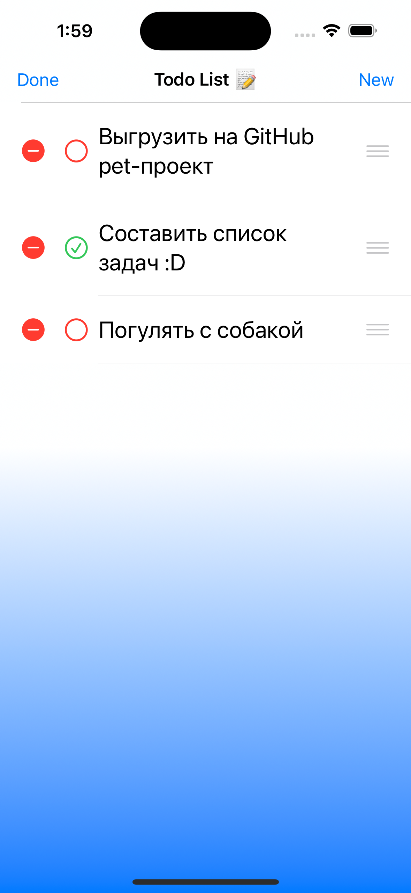

# To do List - pet-проект IOS приложения для личных заметок

## - Язык программировния - Swift

## - Фреймворк создания интерфейса - SwiftUI

## - Архитектурный паттерн - MVVM

### Компоненты паттерна:

1. Models - описывает используемые в приложении данные.

- ItemModel - хранит структуру задач

id - id задачи

title - название задачи

isCompleted - выполнена или нет

2. Views - описывает визуальное представление приложения

- ListView - Отображает view списка задач, или NoItemsView в случае их отсутствия

- ListRowView - Отобраает оформление задачи

- AddView - view добавления новой задачи

- NoItemsView - Отображает view при отсутствии задач

- Launch Screen - Storyboard view запуска приложения

3. ViewModels - модель предствления, связывает модель и представление

- ViewModels - класс функций обработки задач

Содержит CRUD-функции (создание, чтение, обновление и удаление)

## - Запись и чтение данных (задач) - UserDefaults

## - вид данных - JSON

Хоть и правильнее использовать Core Data, но в данном случае проект не является эталонным приложением, подлежащим выгрузке в App Store;

В UserDefaults рекомендуется хранить не более 512 Кбайт, а так как данные кодируются в JSON, они имеют формат UTF-8, соответственно чтобы заполнить 512 Кбайт UserDefaults, нужно составить условно 10.000 задач, что маловероятно и контрпродуктивно.

## Скриншоты работы приложения

<!DOCTYPE html>
<html>
 <head>
  <meta charset="utf-8">
  <title>Фотографии</title>
 </head>
 <body>
  

    
    
    
    
  

 </body>
</html>
