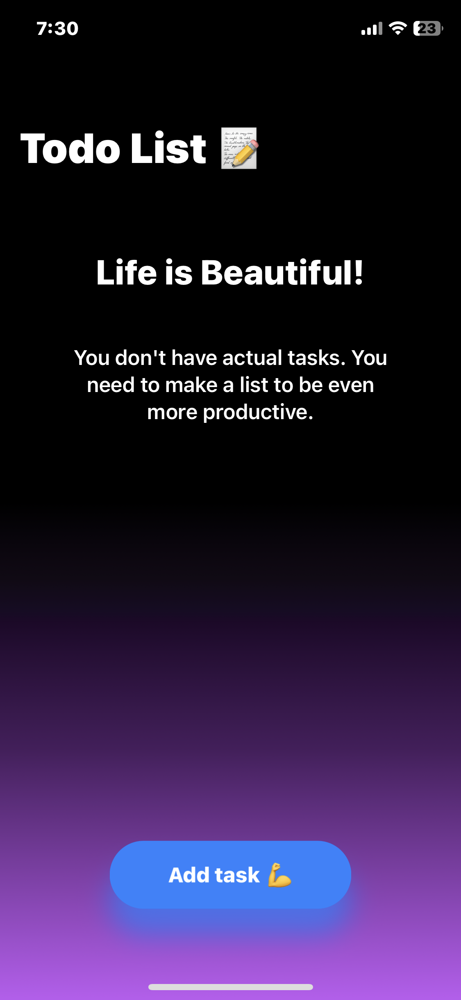
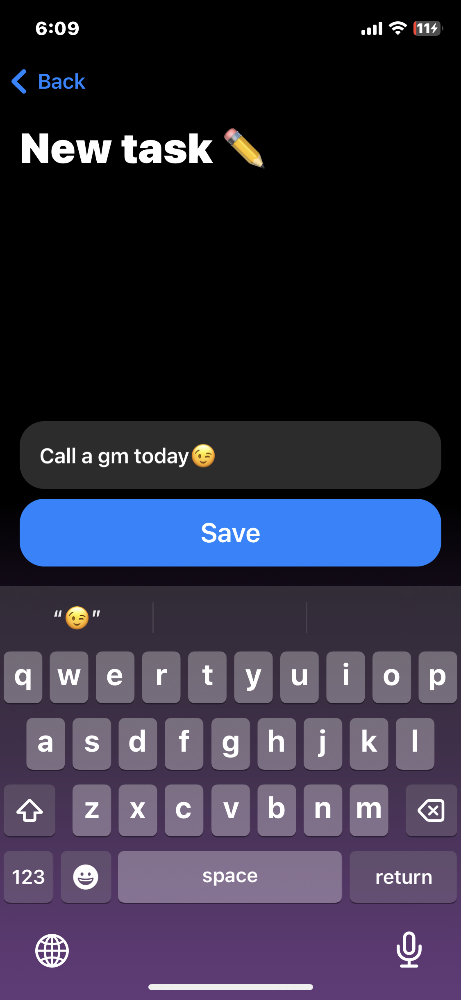
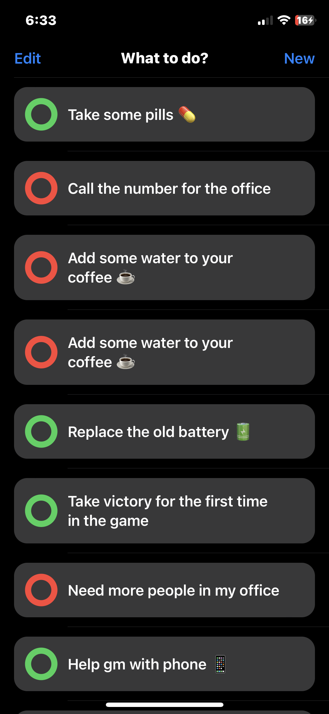
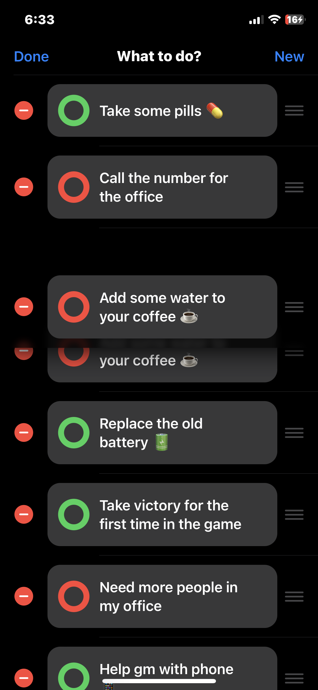

# To do List - pet-project

## Стэк технологий:

1. Swift - язык программирования

2. SwiftUI - фреймворк верстки интерфейсов

3. MVVM - архитектурный паттерн

4. UserDefaults - хранение данных (в файле .plist проекта)

## Из особенностей:

1. Кастомные ячейки "плитки" с цветным шейпом аля "выполнено / невыполнено" (состояния также хранятся в UserDefaults)

2. Кнопка "Add task" имеет кастомную анимацию пульсации с плавным изменением цвета и размера

3. В ViewModel объекте реализованы CRUD функции (создание, чтение, обновление, удаление)

## Screenshots:

<html>
 <body>
  

    
    
    
    
  

 </body>
</html>
